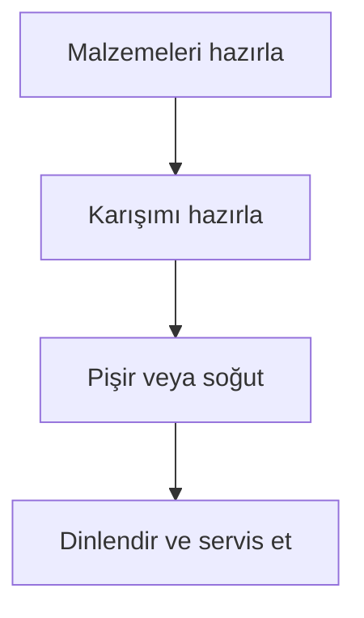

# Recipe Writer

Convert supplied recipe material into a clear, accurate Markdown page under `content/docs/recipes/`. This file contains the complete page format and theme syntax needed for the task. Do not read example recipes, theme documentation, generated site files, or unrelated content merely to learn formatting.

## Input Handling

1. Inspect every supplied input before writing.
2. For video or audio, use available speech, captions, transcript, visible text, and relevant frames.
3. Merge repeated facts from multiple inputs into one coherent recipe.
4. Preserve explicit quantities, units, temperatures, times, yield, equipment settings, and operation order.
5. Remove conversational filler, sponsorship, unrelated commentary, and duplicated steps.
6. Do not invent missing ingredients, quantities, timings, temperatures, yields, or techniques.
7. If an ambiguity prevents a usable recipe, ask one concise question. Otherwise, retain the ambiguity as a clearly labeled note.

## Minimal Repository Inspection

Keep repository reads narrowly scoped:

1. List only the immediate directories and recipe filenames under `content/docs/recipes/`.
2. Prefer an existing category whose name clearly matches the dish.
3. Search for a likely duplicate using the dish name and close filename variants. Read only a likely duplicate before deciding whether to update it.
4. Do not open recipes solely as formatting examples. The required format is defined below.
5. Do not inspect `themes/`, `public/`, or `resources/`; the required theme syntax is defined below.
6. Create a new category only when no existing category is a reasonable semantic match.

If a new category is necessary, create `<Category>/_index.md` with this exact structure, replacing only the title and icon when a known suitable icon is available:

```yaml
---
title: Category Name
weight: 101
params:
  bookHidden: false
  bookToC: true
  bookCollapseSection: false
  bookFlatSection: false
---
```

Follow it with:

```markdown
## Recipes
```

Use a concise, human-readable category directory and recipe filename. Keep an existing recipe at its current path when updating it unless the user explicitly requests a move.

## Language

Write in the language requested by the user. Otherwise, use the dominant language of the source. If neither determines a language, use Turkish. Translate all headings consistently; do not mix heading languages.

## Fixed Recipe Format

Every recipe must use the following order:

1. One H1 recipe title
2. A short summary hint
3. Ingredients
4. Instructions
5. Optional useful notes, serving, storage, or workflow diagram

Ingredients must always appear before instructions. Use this template and replace the placeholders:

````markdown
# Tarif Adı

> [!NOTE]
> **Tarif Özeti**  
> Yemeği, ayırt edici özelliklerini ve uygunsa yaklaşık porsiyon bilgisini açıklayan bir veya iki kısa cümle.

## Malzemeler

| Malzeme | Miktar | Notlar |
| :--- | :--- | :--- |
| Malzeme adı | Kaynakta verilen miktar | Hazırlık veya açıklama |

## Hazırlanışı

{}
1. ## Aşama Başlığı
   Açık ve uygulanabilir yönergeler. Kaynakta varsa süreyi, sıcaklığı, ateş seviyesini ve görsel/dokusal kontrol işaretlerini belirtin.

2. ## Sonraki Aşama
   İşlemleri kronolojik sırayla açıklayın.
{}
````

Formatting rules:

- Put one ingredient on each table row.
- Put preparation details such as “finely chopped” or “at room temperature” in `Notlar` when practical.
- Use `-` for an amount that the source genuinely does not specify; do not estimate it.
- Group instructions into meaningful stages. Each stage must contain one or more complete actions.
- Keep prose concise and practical. Use imperative instructions.
- Include equipment settings and safety-critical handling when supplied or necessary, especially for pressure cooking, hot oil, raw meat, allergens, and storage.
- Verify that every ingredient mentioned in the instructions appears in the table and that each listed ingredient is accounted for when the source explains its use.

## Hugo Book Features

The site supports the following features directly. Use them when they improve the recipe; do not read theme documentation to rediscover their syntax.

### Steps

Use the `steps` shortcode for the instruction section. Each numbered item begins with an H2 stage title, followed by indented Markdown content:

```tpl
{}
1. ## Hamuru hazırlayın
   Malzemeleri pürüzsüz olana kadar karıştırın.

2. ## Pişirin
   Önceden ısıtılmış fırında kaynakta belirtilen süre boyunca pişirin.
{}
```

Keep numbering sequential. Indent each stage description by three spaces so it belongs to the numbered item.

### Hints

Use Markdown alerts sparingly for information that should stand apart from the procedure. Do not use the deprecated `hint` shortcode.

```markdown
> [!NOTE]
> Supplementary context or the recipe summary.

> [!TIP]
> A useful serving suggestion or reliable success cue.

> [!IMPORTANT]
> Information the cook must notice before continuing.

> [!WARNING]
> An important caveat, allergen note, or handling warning.

> [!CAUTION]
> A critical burn, pressure, contamination, or food-safety warning.
```

Use `NOTE` for the recipe summary. Do not duplicate the same information in multiple alerts.

### Mermaid Diagrams

Add a Mermaid workflow only for recipes with branching, parallel, or otherwise complex preparation. Omit it for straightforward linear recipes. Place it after the instructions under `## İş Akışı` or the equivalent translated heading.

````markdown
## İş Akışı


````

Mermaid rules:

- Use `flowchart TD` by default.
- Keep node labels short and useful.
- Represent parallel preparations as separate branches that merge at the correct stage.
- Ensure the diagram matches the written instructions exactly.
- Do not add CSS classes, custom initialization, or decorative complexity.

## File Operations

- Create or update only the recipe and, when required, its category `_index.md`.
- Never edit generated files under `public/` or `resources/`.
- Update a likely existing recipe instead of creating a duplicate unless the user requests otherwise.
- Do not move or rename existing content without an explicit reason.

## Final Check

Before finishing, verify:

- The file is under `content/docs/recipes/` in the best matching category.
- The page has exactly one H1.
- The summary, ingredients, and instructions appear in the required order.
- Ingredients are represented by a Markdown table.
- Instructions use the `steps` shortcode and remain chronological.
- The `steps` shortcode is paired and closed correctly.
- Hints use Markdown alert syntax, never the deprecated `hint` shortcode.
- Any Mermaid diagram is valid and agrees with the instructions.
- No unsupported details were invented.

Report the final recipe path and any unresolved ambiguity in one concise response.