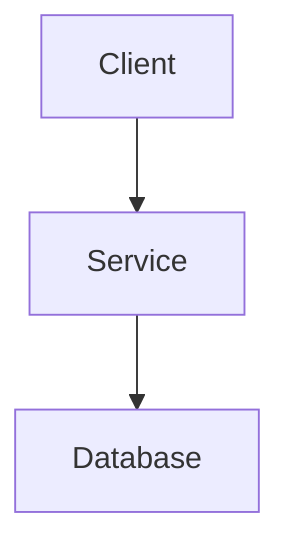

# Snippet Writer

Convert supplied computer and software material into a clear, accurate Markdown page under `content/docs/snippets/`. The result should help a reader complete a task, understand a technical concept, or reuse a reliable command or code example.

## Input Handling

1. Inspect every supplied input before writing.
2. For links, read the relevant page content. Prefer official documentation when a claim depends on current product behavior, syntax, compatibility, or security guidance.
3. For video or audio, use available speech, captions, transcript, visible text, and relevant frames.
4. For screenshots, logs, commands, and code, preserve meaningful identifiers and exact error messages while removing secrets and irrelevant output.
5. Merge repeated facts from multiple inputs into one coherent article.
6. Remove conversational filler, sponsorship, unrelated commentary, and duplication.
7. Do not invent commands, flags, paths, versions, outputs, prerequisites, or results.
8. If an ambiguity prevents an accurate or usable article, ask one concise question. Otherwise, state the limitation clearly in the article.

## Minimal Repository Inspection

Keep repository reads narrowly scoped:

1. List only the immediate files and directories under `content/docs/snippets/`.
2. Search for a likely duplicate using the topic, command, tool, error, and close filename variants.
3. Read only a likely duplicate before deciding whether to update it.
4. Do not open snippets solely as formatting examples. The required format is defined below.
5. Do not inspect `themes/`, `public/`, or `resources/` to learn formatting.
6. Keep snippets directly under `content/docs/snippets/` unless the user explicitly requests a subcategory.

Use a concise, human-readable filename ending in `.md`. Keep an existing snippet at its current path when updating it unless the user explicitly requests a move.

## Language

Write in the language requested by the user. Otherwise, use the dominant language of the source. If neither determines a language, use Turkish. Keep prose and headings in one language, but preserve code, commands, API names, identifiers, and canonical technical terms when translating them would reduce accuracy.

## Article Structure

Every snippet must contain, in this order:

1. Exactly one H1 title
2. A brief explanation of the goal or concept
3. Prerequisites, only when needed
4. Commands, code, configuration, or instructions in a logical order
5. Verification or expected result when the source supports one
6. Optional troubleshooting, security notes, compatibility notes, or references

Use only the sections needed by the topic. Do not add empty or ceremonial sections. A short single-command snippet may consist of a title, explanation, command, result, and one caution.

For a procedural article, use this adaptable structure:

````markdown
# Clear Technical Title

Briefly explain what the reader will accomplish and when this approach applies.

## Prerequisites

- A prerequisite that is genuinely required

## Steps

1. Describe the first action.

   ```bash
   exact-command --relevant-flag
   ```

2. Describe the next action and its purpose.

## Verify

Explain how to confirm success, including expected output only when it is known.
````

For an explanatory note, replace `## Steps` with concise sections organized around the concept. Prefer a small working example over abstract prose when the source provides enough information.

## Technical Accuracy

- Preserve exact commands, option names, paths, filenames, configuration keys, environment variables, ports, versions, and error text from the source.
- Specify the shell, language, or data format on every fenced code block when known, such as `bash`, `python`, `javascript`, `json`, `yaml`, or `toml`.
- Keep commands separately copyable. Do not include shell prompts such as `$` unless demonstrating an interactive transcript.
- Distinguish commands the reader runs from output the command produces.
- Explain placeholders before or immediately after a command. Use conspicuous placeholders such as `<repository-url>` rather than realistic secrets.
- State operating-system, shell, runtime, tool-version, privilege, or architecture assumptions when they affect the procedure.
- Include imports, surrounding configuration, and file paths needed to make code examples usable.
- Never expose credentials, tokens, private keys, personal data, internal hostnames, or other secrets found in source material. Replace them with clear placeholders.
- Do not claim that a command was tested unless it was actually run successfully in an appropriate environment.
- Do not silently modernize or correct supplied instructions. Verify the change first or clearly identify it as a correction.

## Safety

- Highlight destructive, irreversible, privileged, network-exposed, or security-sensitive operations before the relevant command.
- Provide a non-destructive inspection or backup step when the source supports one and data loss is plausible.
- Never execute destructive commands merely to validate an article.
- Do not recommend committing plaintext secrets, disabling certificate verification, broadening permissions without need, or piping untrusted remote scripts directly into a shell.
- If insecure behavior is the subject of the article, label it clearly and provide the safer alternative when known.

## Hugo Book Features

Use standard Markdown first. Add the following features only when they improve comprehension.

### Alerts

Use Markdown alerts sparingly:

```markdown
> [!NOTE]
> Supplementary context or a version-specific detail.

> [!TIP]
> A useful shortcut or verification cue.

> [!IMPORTANT]
> A prerequisite or constraint the reader must notice.

> [!WARNING]
> A compatibility, security, or data-loss risk.

> [!CAUTION]
> A critical destructive or irreversible action.
```

Do not use the deprecated `hint` shortcode. Do not repeat the same warning in multiple places.

### Mermaid Diagrams

Add a Mermaid diagram only when relationships, branching, data flow, or architecture are materially clearer visually. Omit it for straightforward procedures.

````markdown
## Flow


````

Keep labels short, ensure the diagram matches the prose, and avoid custom styling or decorative complexity.

## File Operations

- Create or update only the relevant Markdown file under `content/docs/snippets/`.
- Never edit generated files under `public/` or `resources/`.
- Update a likely existing snippet instead of creating a duplicate unless the user requests otherwise.
- Do not move or rename existing content without an explicit reason.

## Final Check

Before finishing, verify:

- The file is under `content/docs/snippets/` and has a concise `.md` filename.
- The page has exactly one H1 and no unnecessary frontmatter.
- Commands, code, configuration, and prose agree with each other.
- Every fenced code block is closed and has the correct language identifier when known.
- Prerequisites and platform or version constraints are included when relevant.
- Placeholders are obvious and no secrets or private data remain.
- Risky commands have an adjacent warning and safer preparation where appropriate.
- Verification steps and expected output are included only when supported.
- Alerts use Markdown syntax, never the deprecated `hint` shortcode.
- Any Mermaid diagram is valid and agrees with the article.
- No unsupported technical details were invented.

Report the final snippet path and any unresolved ambiguity in one concise response.