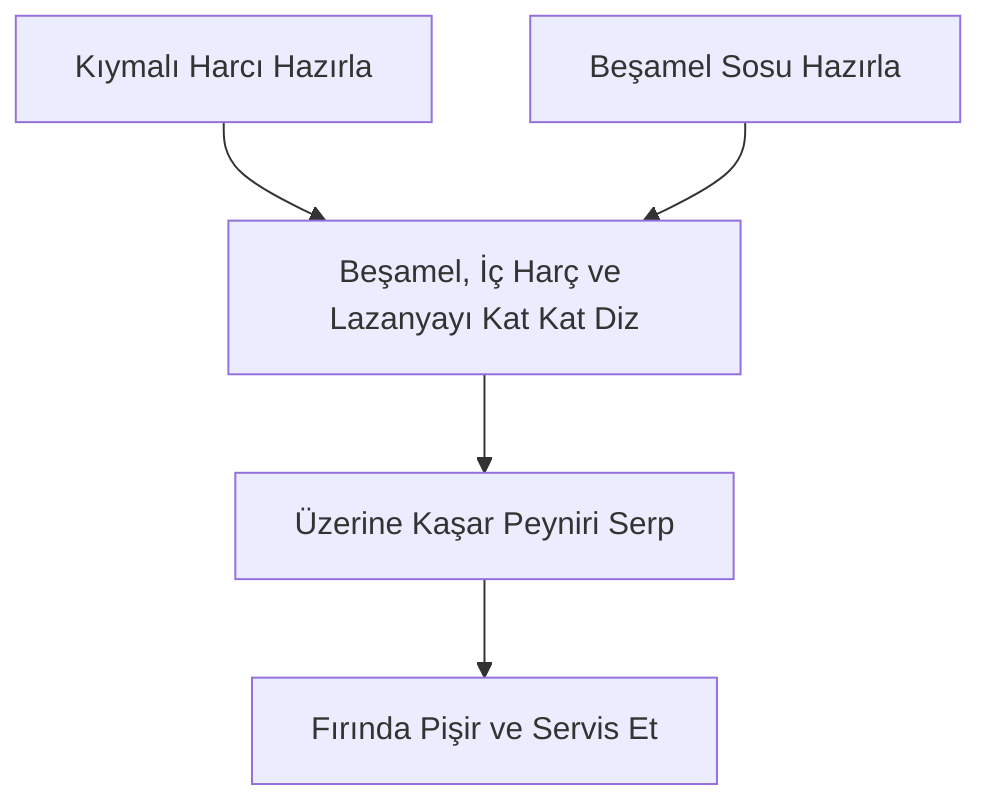

# Lazanya

> [!NOTE]
> **Tarif Özeti**  
> Özel kıymalı ve domatesli harç, pürüzsüz beşamel sos, lazanya yaprakları ve rendelenmiş kaşar peyniri ile kat kat hazırlanan klasik fırın lazanya.

## Malzemeler

| Malzeme | Miktar | Notlar |
| :--- | :--- | :--- |
| Lazanya yaprağı | ~10 yaprak | Tepsi boyutuna göre daha fazla gerekebilir |
| Kaşar peyniri | 1 su bardağı | Rendelenmiş |
| Kıyma | - | Kıymalı harç için |
| Kuru soğan | 1 adet | Yemeklik doğranmış |
| Domates salçası | 1 yemek kaşığı | Kıymalı harç için |
| Biber salçası | 1 yemek kaşığı | Kıymalı harç için |
| Domates rendesi | 1 su bardağı | Kıymalı harç için |
| Su | 2 su bardağı | Kıymalı harç için |
| Zeytinyağı | 4–5 yemek kaşığı | Kıymalı harç için |
| Toz kırmızı biber | 1 tatlı kaşığı | Kıymalı harç için |
| Tuz | Damak tadına göre | Kıymalı harç ve beşamel için |
| Karabiber | Damak tadına göre | Kıymalı harç için |
| Tereyağı | 1 yemek kaşığı | Beşamel sos için |
| Un | 2 yemek kaşığı | Beşamel sos için |
| Süt | 1 su bardağı | Beşamel sos için |
| Su | 1 su bardağı | Beşamel sos için |
| Muskat cevizi | Damak tadına göre | Rendelenmiş (isteğe bağlı) |

## Hazırlanışı

{}
1. ## Kıymalı Harcı Hazırlayın
   Geniş bir tavada zeytinyağını (4–5 yk) ısıtın. Yemeklik doğranmış soğanı (1 adet) ekleyip pembeleşinceye kadar kavurun. Kıymayı ekleyip suyunu çekene kadar soteleyin. Domates salçası (1 yk) ve biber salçasını (1 yk) ekleyip kokusu çıkana kadar kavurun. Toz kırmızı biber (1 tk), domates rendesi (1 sb), tuz ve karabiberi ekleyip 2-3 dakika kaynatın. Suyu (2 sb) ekleyin ve 5 dakika daha kaynatıp ocaktan alın.

2. ## Beşamel Sosu Hazırlayın
   Sos tenceresinde tereyağını (1 yk) eritin. Unu (2 yk) ekleyip kokusu çıkana kadar kavurun. Süt (1 sb) ve suyu (1 sb) yavaşça eklerken çırpıcıyla sürekli karıştırın. Kıvam alıp koyulaşana kadar orta-kısık ateşte karıştırarak pişirin. Ocaktan almadan önce tuz ve arzuya göre rendelenmiş muskat cevizini ekleyin.

3. ## Katmanları Oluşturun
   Fırın kabının tabanından başlayarak sırasıyla beşamel sos, kıymalı harç ve lazanya yaprağı katlarını dizin (Beşamel -> İç Harç -> Lazanya Yaprağı sıralamasını tekrarlayın).

4. ## Pişirin ve Servis Edin
   En üst kata kalan beşamel sosu sürün ve rendelenmiş kaşar peynirini (1 sb) eşit şekilde yayın. Önceden ısıtılmış fırında lazanya yaprakları yumuşayıp kaşar peyniri üzerleri kızarana kadar pişirin.
{}

## İş Akışı

## Şefin Notları

> [!TIP]
> **Beşamel Sos Aroması**  
> Beşamel sosa az miktarda muskat cevizi rendelemek süt lezzetini öne çıkarır ve sosa zengin bir aroma kazandırır.

> [!NOTE]
> **Yaprak Miktarı**  
> Kullanılan fırın kabının genişliğine ve kat sayısına bağlı olarak 10 yapraktan daha fazla lazanya gerekebilir. Kabınızın boyutuna göre yaprak miktarını ayarlayabilirsiniz.
