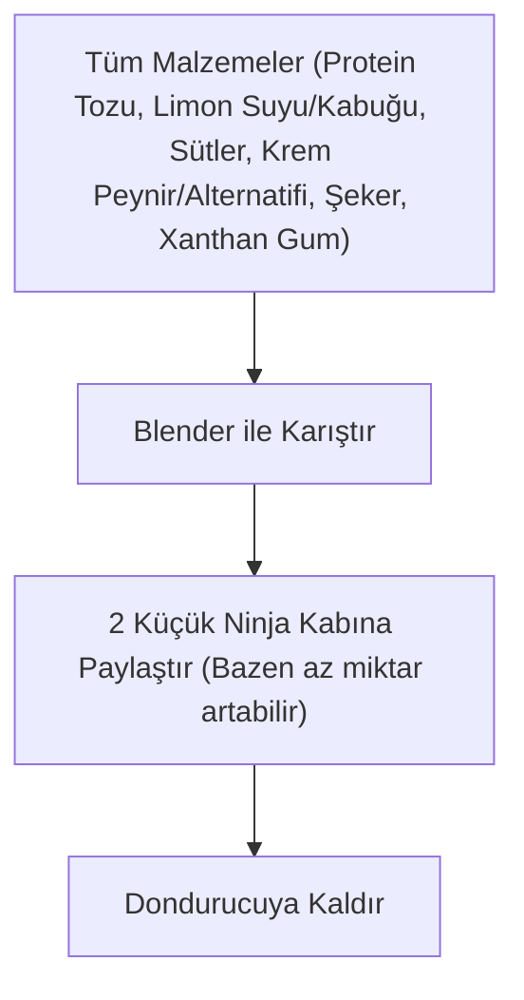

# Ninja Limonlu Proteinli Dondurma

> [!info] Tarif Özeti
> Vanilyalı whey protein tozu, taze limon suyu ve kabuğu rendesi ile hazırlanan, Ninja Creami kaplarına uygun yüksek proteinli ve ferahlatıcı dondurma tarifi.

## Malzemeler

| Malzeme | Miktar | Notlar |
| :--- | :--- | :--- |
| Protein Tozu (Whey) | 54 gr | Vanilya aromalı |
| Limon Kabuğu | 1 adet | Rendelenmiş |
| Limon Suyu | 1 adet | |
| Badem Sütü | 300 ml | |
| Laktozsuz Süt | 300 ml | |
| Krem Peynir | 15 gr | Alternatif: 10 gr kaymak, 15 gr yoğurt veya 15 ml krema |
| Şeker | 20 gr |  |
| Ksantan Gam (Xanthan Gum) | 1/2 çay kaşığı (turk cay kasigi) | Kıvam arttırıcı |

## Hazırlanışı

### 1. Karıştırma
1. **Protein Tozu (Vanilyalı Whey)**, **Limon Kabuğu Rendesi**, **Limon Suyu**, **Badem Sütü**, **Laktozsuz Süt**, **Krem Peynir** (veya seçilen alternatif), **Şeker** ve **Ksantan Gam (Xanthan Gum)** malzemelerini blender kabına ekleyin.
2. Tüm malzemeleri blender yardımıyla pürüzsüz ve homojen bir kıvam alana kadar karıştırın.

### 2. Ninja Kaplarına Paylaştırma
1. Hazırlanan karışımı 2 adet küçük Ninja Creami dondurma kabına eşit şekilde paylaştırın *(bazen az bir miktar artabilir)*.
2. Kapların kapaklarını kapatıp dondurulmak üzere dondurucuya kaldırın.

---

## İş Akışı (Flowchart)

