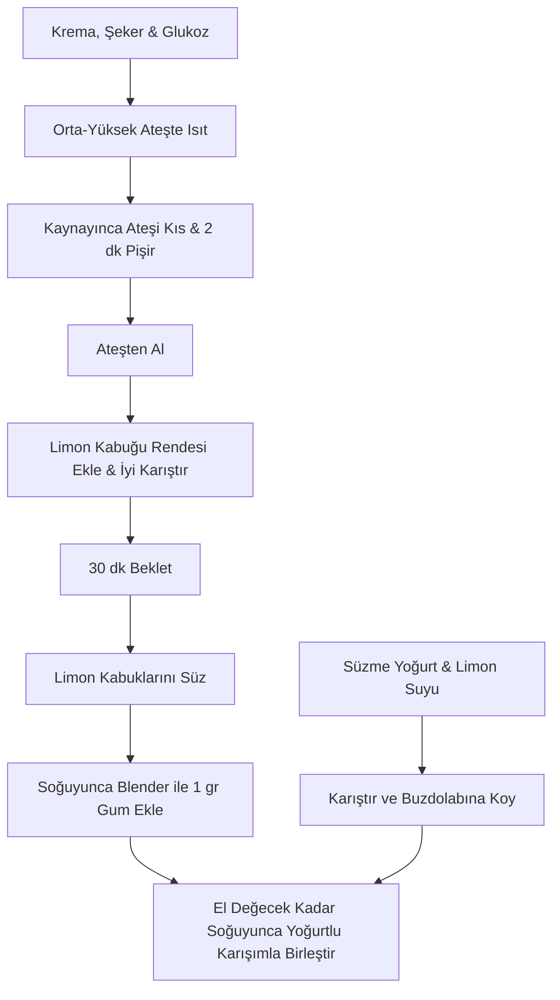

# Limonlu Dondurma

> [!info] Tarif Özeti
> Yoğurt bazlı, taze limon suyu ve limon kabuğu rendesi (zest) ile hazırlanan ferahlatıcı limonlu dondurma tarifi.

## Malzemeler

| Malzeme | Miktar | Notlar |
| :--- | :--- | :--- |
| Süzme Yoğurt | 400 gr | |
| Limon Suyu | 150 gr | Yaklaşık 3/4 su bardağı (6 limon gibi) |
| Krema | 200 gr | |
| Şeker | 200 gr | |
| Glukoz | 50 gr | |
| Limon Kabuğu Rendesi (Zest) | 6 gr | İyi karıştırılmalı |
| Gum (Kıvam Arttırıcı) | 1 gr | Krema/zest karışımı soğuyunca blender ile eklenecek |

## Hazırlanışı

### 1. Yoğurt & Limon Tabanı
1. **Süzme Yoğurt** ve taze **Limon Suyunu** homojen bir şekilde karıştırın.
2. Karışımı soğuması için buzdolabına kaldırın.

### 2. Şurup Hazırlama ve Zest Ekleme
1. Orta-yüksek ateşte (medium-high heat) **Krema**, **Şeker** ve **Glukozu** ısıtın.
2. Karışım kaynamaya başladığında ateşi kısın ve 2 dakika boyunca bu şekilde pişirin. Ardından ateşten alın.
3. Ateşten aldığınız sıcak karışıma **limon kabuğu rendesini (lemon zest)** ekleyin ve iyi karıştırın. Karışımı 30 dakika beklemeye bırakın.
4. Süre sonunda karışımdaki limon kabuğu rendelerini süzün.
5. Krema/zest şurubu tamamen soğuduğunda **1 gr gum** ekleyip blender ile iyice karıştırarak yedirin.

### 3. Birleştirme
1. Şurup karışımı el değecek sıcaklığa kadar soğuduğunda, buzdolabında bekleyen yoğurtlu karışım ile birleştirin ve iyice karıştırın.

---

## İş Akışı (Flowchart)

