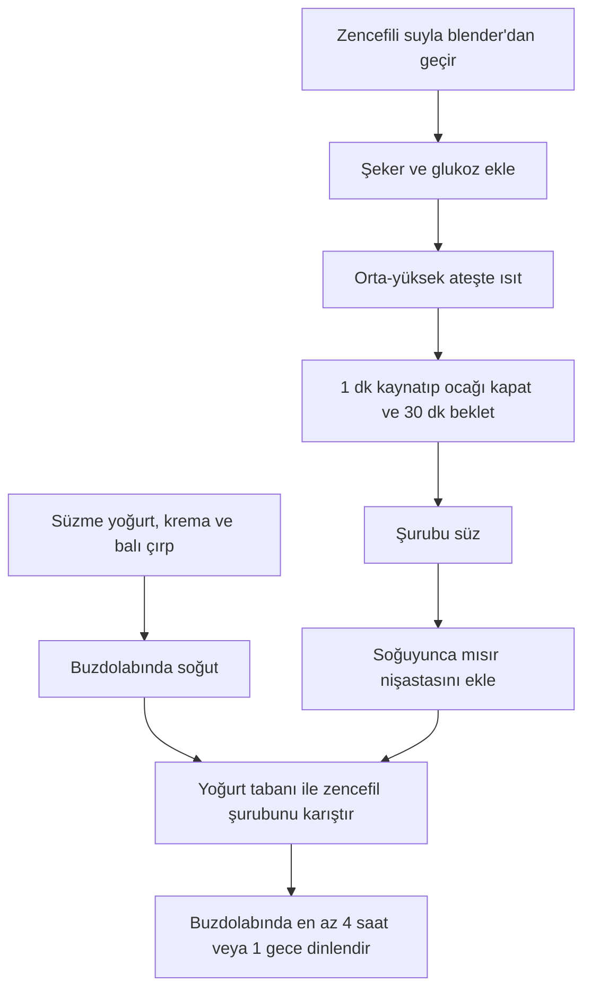

# Ginger Dondurma (Zencefilli Dondurma)

> [!NOTE]
> **Tarif Özeti**  
> Taze zencefil aromalı, süzme yoğurt ve krema bazlı ferahlatıcı bir dondurma tarifi.

## Malzemeler

| Malzeme | Miktar | Notlar |
| :--- | :--- | :--- |
| Süzme yoğurt | 400 g | - |
| Krema | 200 g | - |
| Bal | 50 g | - |
| Taze zencefil | 50 g | Bezelye büyüklüğünde doğranmış |
| Su | 150 g | - |
| Şeker | 150 g | - |
| Glukoz | 50 g | - |
| Mısır nişastası | 10 g | - |

## Hazırlanışı

{}
1. ## Yoğurt Tabanını Hazırlayın
   Süzme yoğurt, krema ve balı pürüzsüzleşene kadar çırpın. Karışımı buzdolabına kaldırıp soğumaya bırakın.

2. ## Zencefil Şurubunu Pişirin
   Bezelye boyutunda doğranmış taze zencefili su ile birlikte blender'da çekerek parçalayın. Karışımı bir sos tenceresine aktarın; üzerine şeker ve glukoz ekleyin. Orta-yüksek ateşte ısıtıp kaynamaya başladıktan sonra ateşi kısıp 1 dakika hafifçe kaynatın ve ocağı kapatın.

3. ## Şurubu Demleyin ve Nişastayı Ekleyin
   Demlenmesi için karışımı 30 dakika bekletin ve ardından şurubu süzün. Şurup dokunulacak sıcaklığa (ılık/soğuk) gelince mısır nişastasını ekleyip karıştırın.

4. ## Birleştirin ve Dinlendirin
   Zencefil şurubunu buzdolabındaki yoğurtlu karışım ile birleştirip iyice karıştırın. Dondurma karışımını buzdolabında en az 4 saat veya tercihen 1 gece bekletin.
{}

## İş Akışı

