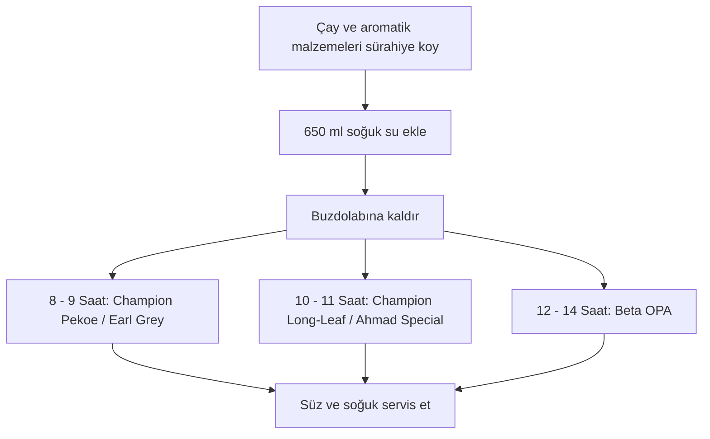

# Soğuk Demleme Çay Tarifleri

> [!NOTE]
> **Tarif Özeti**  
> Farklı çay türleri (Beta OPA, Champion Pekoe, Champion Long-Leaf, Ahmad Special, Earl Grey) ve doğal aromatikler ile hazırlanan ferahlatıcı soğuk demleme çay rehberi.

## Malzemeler

| Malzeme | Miktar | Notlar |
| :--- | :--- | :--- |
| Çay (Çeşide göre) | 8–12 g | Beta OPA (12 g), Champion Pekoe (8 g), Champion Long-Leaf (10 g), Ahmad Special (10 g) veya Earl Grey (8 g) |
| Soğuk su | 650 ml | Her demleme için sabit su miktarı |
| Karanfil | 2–3 adet | Beta OPA (2 adet ezilmiş), Champion Pekoe (2 adet) veya Earl Grey (3 adet) |
| Tarçın | 2 çubuk | Champion Pekoe veya Ahmad Special için |
| Limon kabuğu / dilimi | Yarım kabuk / 2 dilim | Beta OPA (yarım limon kabuğu) veya Earl Grey (2 dilim limon) |
| Taze zencefil | Bozuk para büyüklüğünde | Champion Long-Leaf için |
| Taze nane | 5–6 yaprak | Champion Long-Leaf için |
| Portakal kabuğu | 1 parça | Ahmad Special için |

## Hazırlanışı

{}
1. ## Çay ve İlave Malzemeleri Hazırlayın
   Seçtiğiniz çay türünü ve tarifteki ilave baharat/meyve malzemelerini (ezilmiş karanfil, çubuk tarçın, narenciye kabuğu, zencefil veya nane) demleme sürahisine alın.

2. ## Soğuk Su Ekleyin
   Sürahiye 650 ml soğuk su ilave edin ve malzemelerin suya temas etmesi için hafifçe karıştırın.

3. ## Buzdolabında Demleyin
   Sürahinin kapağını kapatıp buzdolabına kaldırın. Çay çeşidine uygun süre boyunca demlenmeye bırakın:
   - **Champion Pekoe & Earl Grey:** 8 – 9 saat
   - **Champion Long-Leaf & Ahmad Special:** 10 – 11 saat
   - **Beta OPA:** 12 – 14 saat

4. ## Süzün ve Servis Edin
   Demleme süresi tamamlandığında çayı süzgeç yardımıyla süzün. İsteğe göre buz ilave ederek soğuk servis edin.
{}

## İş Akışı

